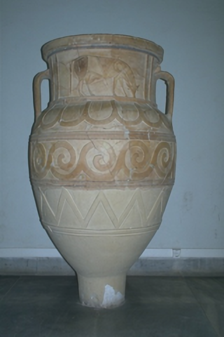

## SwinFIR:

- Using the SFB block in SwinIR network instead of the last conv layer in RSTB block. 

- I trained this model on DIV2K dataset and evaluate on Set5 and Set14. 
- Also Test on Benchmarks: Set5, Set14, BSD100, Uraban100, Manga109

- Total Iteration: 500K
- Loss Function: Charbonier Loss
- Total Params of SwinFIR : 14,350,211 
- Metrics to evaluate: PSNR, SSIM, LPIPS

**Some Visulization of resutls (X2):**

    
    
    

**SwinFIR Testing Results (X2):**

  Dataset   |    PSNR   |    SSIM    |   LPIPS  |
    :--         :-:         :-:           :-:     
    Set5    |  38.3215  |   0.9623   |  0.0514  |
    Set14   |  34.1799  |   0.9227   |  0.0840  |
  Urban100  |  33.1972  |   0.9493   |  0.0321  |
   BSD100   |  32.4529  |   0.9031   |  0.1193  |
  Manga109  |  39.5940  |   0.9790   |  0.0216  |
